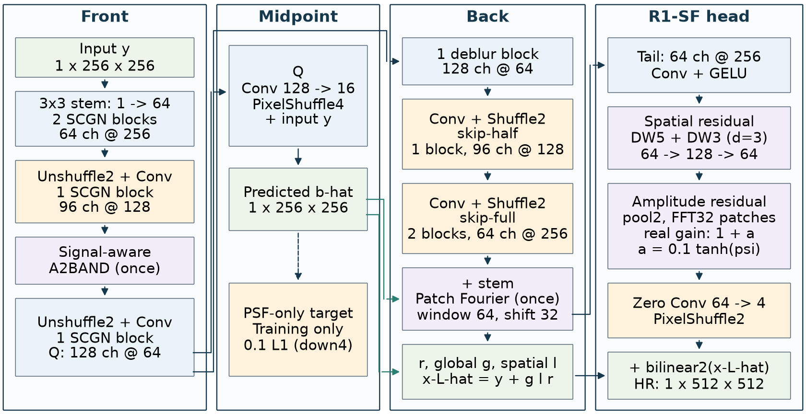
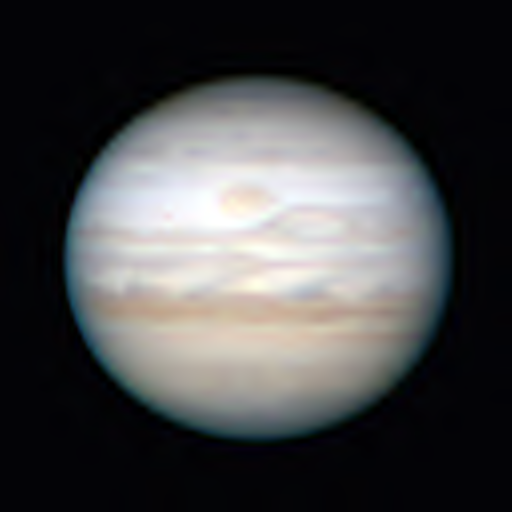
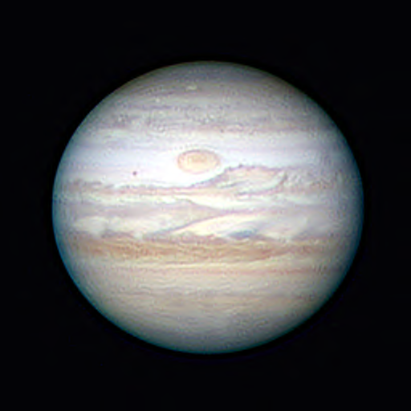

<h1 align="center">ASTRA-SR</h1>
<p align="center"><strong>Atmospheric Seeing and Turbulence Restoration for Astronomical Image Super-Resolution</strong></p>
<p align="center">Xining Ge · <a href="https://cuiziteng.github.io/">Ziteng Cui</a> · <a href="https://shuhongll.github.io/">Shuhong Liu</a></p>

<p align="center">
  <a href="https://arxiv.org/abs/2609.26731"></a>
  <a href="https://huggingface.co/datasets/xiningning/astrasr_data"></a>
  <a href="https://huggingface.co/datasets/xiningning/astrasr_data/tree/main/checkpoints"></a>
  <a href="LICENSE"></a>
</p>

Official implementation of **ASTRA-SR** for blind, single-frame astronomical
image restoration and 2× super-resolution. A single 256×256 degraded grayscale
frame is restored to 512×512, without a PSF or noise map at inference.



[Installation](#installation) · [Inference](#inference) · [Dataset](#dataset) ·
[Evaluation](#evaluation) · [Training](#training) · [Citation](#citation)

## Release status

- Model code, the epoch-20 CONTROL checkpoint and all train/val/test shards are published.
- Public entry points are `infer.py`, `evaluate.py`, `train.py` and `scripts/prepare_dataset.py`.
- The original experiment files remain in `paper_*.py`, `configs/` and `frozen/` for provenance.
- Full training and the complete 1,355-image validation have **not** been rerun with the portable adapters. See [release scope and validation limits](docs/RELEASE_SCOPE.md).
- Historical baseline wrappers require additional source trees. Third-party source/license mapping and the complete raw-source rebuild inputs still need a maintainer review.

## Installation

Use **Python 3.12**. Install a CPU or CUDA PyTorch build appropriate for your
machine using [PyTorch's installation instructions](https://pytorch.org/get-started/locally/),
then install the dependencies from the repository root:

```bash
git clone https://github.com/I2WM/ASTRA-SR.git
cd ASTRA-SR
python -m pip install -r requirements.txt
# Training or evaluation:
python -m pip install -r requirements-eval.txt
```

Inference and evaluation support CPU and CUDA. The original training schedule
uses CUDA, fp16 AMP, batch 36 for epochs 1–5 and batch 24 for epochs 6–20.
It was dispatched on 48 GB GPUs; this is historical hardware, not a measured
minimum requirement. Data generation has optional dependencies in
`requirements-data.txt`; baseline wrappers have `requirements-baselines.txt`.

## Inference

Download the checkpoint independently of the large dataset:

```bash
hf download xiningning/astrasr_data checkpoints/astra_sr_control_epoch20.pt \
  --repo-type dataset --revision 554f85202f20b94e2e569b6d2d969adf4f344933 --local-dir .
python infer.py --checkpoint checkpoints/astra_sr_control_epoch20.pt \
  --input path/to/degraded_lr256.fits --output outputs/restored_hr512.fits --device cpu
```

FITS/NPY input uses the frozen intensity scale of 2,500. PNG input is interpreted
as normalized image intensity; it is a visualization input, not a substitute for
the benchmark's FITS arrays. Inputs larger than 256×256 are center-cropped.
Use a single grayscale plane. FITS/NPY outputs preserve floating-point values;
PNG output clips to [0,1] and quantizes to 8 bits.
8-bit inputs use a 255 peak; 16-bit PNG/TIFF inputs use 65,535, including
both TIFF byte orders. Convert color images to grayscale explicitly;
multi-channel images and NaN/Inf inputs are rejected.

The official checkpoint SHA-256 is checked before loading. For your own trained
CONTROL checkpoint, pass its hash with `--checkpoint-sha256`. Use `evaluate.py`
with the matching `--variant` for ablation checkpoints.

| Real observation | ASTRA-SR |
|---|---|
|  |  |

These real observations have no clean ground truth and are qualitative examples.

## Dataset

[Hugging Face: xiningning/astrasr_data](https://huggingface.co/datasets/xiningning/astrasr_data)
contains **all 66,293 samples**, 134 compressed shards and the released
checkpoint/PSF asset. At revision `554f852`, there are 277 files totalling
136.95 GB (decimal). Archives retain the original float32 FITS values.

| Split | real | png | Total | Shards |
|---|---:|---:|---:|---:|
| Train | 57,860 | 5,722 | 63,582 | 126 |
| Validation | 677 | 678 | 1,355 | 4 |
| Test | 678 | 678 | 1,356 | 4 |

`real` and `png` are the historical source-kind labels. The paper describes
Cassini ISS clean sources and a physical degradation pipeline using six MASS
altitudes, spatially varying PSFs and Gaussian read noise. The published index
is disjoint by `source_id`; this is not a claim of independence between all
observation sequences or source images with different identifiers.

Download only the splits you need:

```bash
# Download, verify and extract validation; also fetch weights and the PSF bank.
python scripts/prepare_dataset.py --splits val --local-dir astrasr_data --artifacts
# Complete training data, with validation for epoch-end evaluation:
python scripts/prepare_dataset.py --splits train val --local-dir astrasr_data
# Test split, independently:
python scripts/prepare_dataset.py --splits test --local-dir astrasr_data
```

The script pins the release revision, checks SHA-256, processes only requested
splits, and creates local `records_val.jsonl`, `records_train_val.jsonl`, etc.
It also downloads and verifies the four license/source notices from the
2026-10-08 licensing revision (`6c1228d`), so the current CC BY-NC terms and
Cassini/NASA credits accompany the data. Archive bytes remain pinned to the
original data revision; the notice revision is tracked separately.
The immutable `dataset_index.jsonl` uses relative paths; local indices use your
extraction directory and deliberately have different hashes from the historical
server `records.jsonl`. Archives are kept by default. Use `--remove-archives`
only if you want them removed after successful extraction/index validation.
Use `--local-only` for an existing download or `--download-only` to skip extraction.
Allow room for both compressed and extracted data (roughly 300 GB for the full
release, plus filesystem/cache overhead).

```text
astrasr_data/
  dataset_index.jsonl
  x2_dataset_protocol_lrdegrade_v2.json
  SHA256SUMS.txt
  records_val.jsonl
  archives/
  extracted/<split>/<kind>/
    clean_hr512/       # 512×512 target
    clean_lr256/      # 256×256 diagnostic target
    degraded_lr256/   # 256×256 model input
    psf_only_lr256/   # 256×256 intermediate supervision
    noise_only_lr256/ # 256×256 diagnostic image
    noise_map_lr256/  # 256×256 pre-clipping noise realization
```

## Evaluation

```bash
python evaluate.py --data-dir astrasr_data \
  --checkpoint astrasr_data/checkpoints/astra_sr_control_epoch20.pt \
  --output-dir outputs/validation --device cpu --batch-size 1
```

Use CUDA for practical full-validation throughput. Metrics follow the original
per-image PSNR/SSIM and robust foreground-mask Obj.-PSNR formulas, with values
scaled by 1/2500 and clamped to [0,1]. The default evaluation requires all 1,355
validation images. `--max-samples 2` performs a plumbing check and records
`SMOKE_ONLY`; its scores must not be reported as paper results.

The following numbers are transcribed from
[paper Table 1](https://arxiv.org/html/2609.26731v1#S4.T1), not a new run:

| Method | PSNR ↑ | SSIM ↑ | Obj.-PSNR ↑ |
|---|---:|---:|---:|
| NAFNet | 35.275 | 0.843 | 31.434 |
| RDBM | 34.618 | 0.844 | 31.661 |
| SCGN | 35.138 | 0.846 | 31.620 |
| StarIR | 35.218 | 0.844 | 31.553 |
| **ASTRA-SR** | **35.824** | **0.849** | **32.148** |

These are validation results with a fixed epoch-20 selection, not held-out test
scores. The Obj.-PSNR improvement over the highest baseline in this table is
0.487 dB (32.148 − 31.661). CPU fp32 and GPU fp16 may produce small differences.

## Training

```bash
# Check original source hashes, metadata, sample counts and required FITS paths.
python train.py --variant CONTROL --data-dir astrasr_data --run-dir runs/control --dry-run
# Full 20-epoch schedule:
python train.py --variant CONTROL --data-dir astrasr_data --run-dir runs/control
# Resume a checkpoint produced by this portable entry point:
python train.py --variant CONTROL --data-dir astrasr_data --run-dir runs/control \
  --resume runs/control/checkpoints/step_000128.pt
```

The training adapter reuses the frozen model, loss, numerical retry logic and
sampler. It preserves seed 0, AdamW (lr 1e-4, weight decay 1e-4), the 36→24 batch
schedule and 48,585 updates. The learning rate decays during the last 25% of the
**first 8,835 steps**, then stays at 1e-5 for epochs 6–20. Each epoch runs full
validation. The original machine-specific smoke gate is replaced by portable
source/data validation; the archived gate is not claimed to have run locally.

`--max-steps 1` checks CUDA training on a new run directory using the original
batch size; it marks the result/checkpoint as smoke-only. For ablations select
`NO_A2BAND`, `NO_MID_LOSS`, `NO_BACK_LOCAL`, `NO_PATCH`, `NO_CONFIDENCE`,
`NO_SR_S`, `NO_SR_F` or `NO_SR_SF`.

## Repository layout and provenance

| Path | Role |
|---|---|
| `infer.py`, `train.py`, `evaluate.py` | Public entry points |
| `release_utils.py`, `scripts/prepare_dataset.py` | Hash verification, download and path adaptation |
| `paper_models.py`, `frozen/` | Original model and dependency snapshot |
| `paper_train.py`, `paper_smoke.py`, `paper_queue.py`, `configs/` | Original experiment trainer/contracts; not portable launch commands |
| `data_pipeline/` | Historical generation/validation sources and frozen protocol |
| `evaluation/` | Historical evaluator and server-specific wrapper; use root `evaluate.py` |
| `docs/` | Provenance, release scope and evidence |

[Provenance](docs/PROVENANCE.md) distinguishes the original experiment hashes
from the current release hashes in `SHA256SUMS.txt`. Original absolute paths
in frozen evidence identify historical inputs; public entry points do not use
them. `docs/SHA256SUMS.txt` describes an earlier supplement bundle, not this Git
checkout. See [third-party review status](THIRD_PARTY_NOTICES.md).
The repository preserves file bytes with `.gitattributes`, so Windows Git
line-ending conversion does not invalidate the scientific snapshot hashes.

## Citation

```bibtex
@misc{ge2026astrasr,
  title = {ASTRA-SR: Atmospheric Seeing and Turbulence Restoration for Astronomical Image Super-Resolution},
  author = {Xining Ge and Ziteng Cui and Shuhong Liu},
  year = {2026},
  eprint = {2609.26731},
  archivePrefix = {arXiv},
  primaryClass = {cs.CV},
  url = {https://arxiv.org/abs/2609.26731}
}
```

## License and attribution

**Code, model weights and dataset contributions are released under
[CC BY-NC 4.0](https://creativecommons.org/licenses/by-nc/4.0/): attribution
is required and commercial use is not granted.** See the full [LICENSE](LICENSE)
and [license scope](LICENSE_SCOPE.md). Upstream materials retain their own
terms; permissions validly granted for earlier versions are not revoked.

The Cassini-derived data originate from **NASA's Cassini Imaging Science
Subsystem (ISS)**. We acknowledge **NASA / JPL-Caltech / Space Science Institute**
for the underlying observations and the **NASA Planetary Data System** for
the archive. Official sources:
[Cassini mission](https://science.nasa.gov/mission/cassini/),
[Cassini ISS archive](https://pds-rings.seti.org/cassini/iss/),
[NASA PDS](https://pds.nasa.gov/).

ASTRA-SR adds source curation, paired resampling, simulated turbulence/noise
degradation and split metadata. These are processed derivatives, not
unmodified NASA products. Retain source credits and indicate changes.
See [data sources and acknowledgments](DATA_SOURCES.md) for a reusable credit
line, processing details and the separate auxiliary `png` source status.
[Third-party notices](THIRD_PARTY_NOTICES.md) document remaining provenance work.
